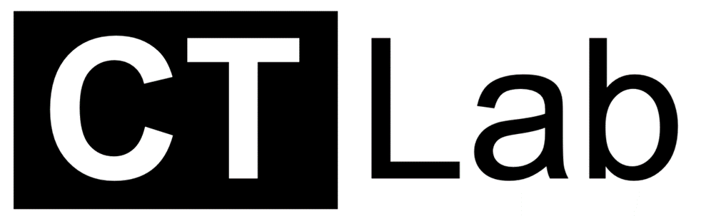

# A Numerical Computed Tomography Simulator

## Overview
The CTlab is virtually implemented medical imaging device, which can be widely used in computed tomography training for all professionals who use radiation in their work. The simulator provides fast, comprehensive, and efficient solutions for numerical CT simulations with low hardware requirements. The simulator has been developed to introduce the basic operations and workflow behind the CT imaging modality and to illustrate how the polychromatic x-ray spectrum, various imaging parameters, scan geometry and CT reconstruction algorithm affect the quality of the detected CT images.

## Features

The CTlab offers its users an opportunity in CT simulations

- [x] To create the desired X-ray spectrum 
- [x] To adjust CT imaging parameters (image volume, scan angles, detector element size and detector width, noise, algorithm/geometry specific parameters) 
- [x] To select specific scan geometry, to observe projection data from selected imaging target with polychromatic x-ray spectrum
- [x] To select the specific algorithm for image reconstruction (FBP, least squares, Tikhonov regularization) 

## Versions

- Windows (version 1.4)
- Mac (version 1.0)

Since the use of Astra toolbox is not possible on Mac computers, a slightly separate version of the program has been developed for this purpose. The Mac version does not support iterative reconstruction algorithms or fanflat beam geometry in X-ray projection detection.

## Key User Groups

Key user groups for the simulator include medical physics, engineering, and radiographer students.

## Dependencies

- [MATLAB R2020b](https://se.mathworks.com/products/new_products/release2020b.html)
- [Astra Toolbox](https://www.astra-toolbox.com/downloads/index.html) (Windows version)
- [Spektr 3.0](https://github.com/I-STAR/SPEKTR)
- [Spot](https://github.com/mpf/spot)

CTlab uses two external open source Matlab toolkits. Spektr 3.0 is used to create a polychromatic X-ray spectrum for simulations and Astra toolbox to calculate reconstructions from polychromatic projection data (Not in the Mac version). The user must download both of the aforementioned Toolboxes and place them in Matlab's path in order for CTlab to work correctly. 

## Installation

https://user-images.githubusercontent.com/110446843/190123038-d3f37714-aa86-46d4-9fc1-92d42ed38f1a.mp4

## Platform Overview

The main “Console window” of the CTlab behaves roughly analogous to a clinical CT scanner for graphically adjusting imaging setup and conducting simulation control, providing immediate feedback to the corresponding information panels during the simulation process, and visualizing reconstructed polychromatic and spectral images in the reconstruction windows.

## Demonstration

A short demonstration of CTlab's operation can be viewed on [YouTube](https://www.youtube.com/watch?v=OAGBWjJwCrM)

<!-- ## Workflow of Simulation

### Starting simulation

The virtual object for simulations must be loaded before actual simulation can be performed. By clicking the “Load phantom” button in the “START SIMULATION” panel, the Shepp-Logan phantom will appear in the panel’s image window. The phantom consists of bone, air, water, and iodine.

### X-ray Spectrum

The X-ray spectrum which is utilized in the simulation can be created by clicking the "Generate spectrum" button. The Spectrum tool will then appear on the screen where user can create the desired X-ray spectrum. First, the user must set the X-ray tube settings (kV, exposure, filtration). These parameters allow user to influence the shape of the simulated spectrum. After setting the parameters by pressing the "Generate Spectrum" button, the polychromatic X-ray spectrum will then appear in the figure of the Spectrum tool. The x-axis of the spectrum indicates the energy range of the detected X-ray photons in kiloelectronvolts (keV) and the y-axis the number of obtained X-ray photons per exposure (mAs). spectrum can be also saved by pressing the "Save" button of the Spectrum tool. 

### Reconstruction Algorithm

The algorithm for the image reconstruction can be selected by clicking the "Reconstruction algorithm" button. This will open a window with a dropdown menu offering a few options. In addition to Filtered Backprojection (FBP), the user can select the least squares, or Tikhonov Regularization algorithm to be used for image reconstruction.

### Scan geometry

The projection geometry, used in the virtual CT scan, can be selected by clicking the “Projection geometry” button. A window will then open, where the dropdown menu offers user two options for the projection geometry, parallel and fanflat geometries. 
 
### Scan parameters

After selecting the projection geometry, the desired imaging parameters must be set for the simulation. Click the "Imaging parameters" button to open the "Parameter settings", where you can set the parameters required for your simulation (Figure 8). Each parameter has a default value, so you do not need to change the values if it is not necessary for the simulation. When you change the values, you can individually set the values for the projection angle, image volume, detector width, detector element size, tube current, scan time and image noise. The angle parameters represent the minimum and maximum angle of the virtual scan and the angle step the size between the obtained projections. The volume of the image indicates the reconstruction volume. The detector parameters represent the horizontal width of the detector and the one detector element size. Noise naturally represents the amount of noise detected during the scan. With certain settings, you must set values for additional parameters. If you select Tikhonov regularization as the reconstruction algorithm, the settings also ask for the value of the regularization parameter. If you select the gradient descent algorithm, you must also set the step size of the algorithm. Also, if you selected the least squares or gradient descent algorithm, you will need to adjust the number of iterations for the algorithms. In addition, if you have selected "fanflat" as the projection geometry, you will need to adjust the source-to-origin (SOD) and origin-to-detector distances (ODD).

### Virtual CT Scan

Once all imaging parameters are adjusted and projection geometry, X-ray spectrum, and reconstruction algorithm selected, a virtual CT scan can be performed to obtain the projection data (Figure 9). Do this by clicking the "Scan projections" button, and the detection of CT projections with the adjusted settings will begin. When the virtual scan is complete, you can view the sinogram of the received projections by pressing the "Visualize projections" button.

### Reconstruction

After the virtual scan, the reconstruction of the obtained data can be calculated with chosen algorithm by clicking the “Reconstruction” button (Figure 9). The result of the polychromatic reconstruction appears in the left image window of the console and the “Reconstruction Intensities Figure” illustrates the grayscale intensity range of the obtained reconstruction. You can perform a new simulation by pressing the “Load Phantom” button again.

The contrast of the reconstructed image can be adjusted by using the “Contrast panel” sliders (located at the right side of the “Spectral reconstruction” window). To change the contrast of specific reconstruction, select one of the "check box" options, either “polychromatic or spectral reconstruction”, as active.

### Spectral Reconstruction

Calculating the polychromatic reconstruction with FBP algorithm releases the “Spectral parameters” button (CTlab does not allow this feature with other algorithms). With “Spectral parameters” button, user can adjust the energy interval of X-ray spectrum which is utilized in the spectral imaging as well as the number of energy bins included in the energy interval. To adjust the spectral parameters, click the “Spectral parameters” button (Figure 10). After adjusting spectral parameters, spectrum is now divided into different energy bins by dashed lines (illustrated in “X-ray Spectrum Figure”). By pressing the Visualize spectral images button, program starts to calculate reconstructions related to different bins with FBP algorithm. The progress of the spectral reconstruction is reflected in the updated blocks in the “X-ray spectrum Figure” which represent the calculated energy bins. Once the calculation is completed, you will be able to scroll through the spectral reconstructions by using the spinner tool of the “Simulation control panel” (the bin’s energy range is also updated in the top of the spectral window). You can now compare images at different energy bins to the result of the polychromatic FBP reconstruction and analyze how the image quality and the contrast of the materials changes between spectral images (Figure 11). A new simulation can be started by pressing the "Load phantom" button.
-->

## Documentation

Further documentation and examples will be made available over time.

## Issues

Since CTlab is being widely distributed for the first time, it may contain unforeseen bugs. If you wish, you can report these to the Issues channel. 

Thank you!

## Notice

The software has not been intended or certified as a medical device and, therefore, must not be used to guide any diagnostic or treatment decisions.

## Future version

The Windows version 1.5 will include 

- new imaging target 
- technical image quality analysis tool

The Mac version 1.1 will include

- fanbeam geometry
- new imaging target 
- technical image quality analysis tool

